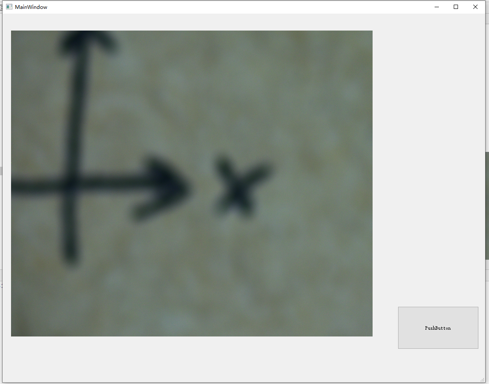
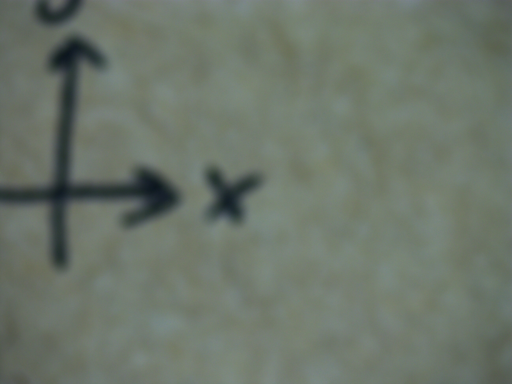

## 安装客户端

[首先安装客户端，得到里面的dll文件](https://www.hikrobotics.com/machinevision/service/download?module=0)

## 运行

运行test文件夹里面的test文件

## 例图

### 软件

pushbutton为拍摄键，左边为实时显示窗口

### 拍摄的图片

### 主要逻辑

使用了两个线程，一个线程进行图片的实时显示，另外一个线程为拍摄照片
